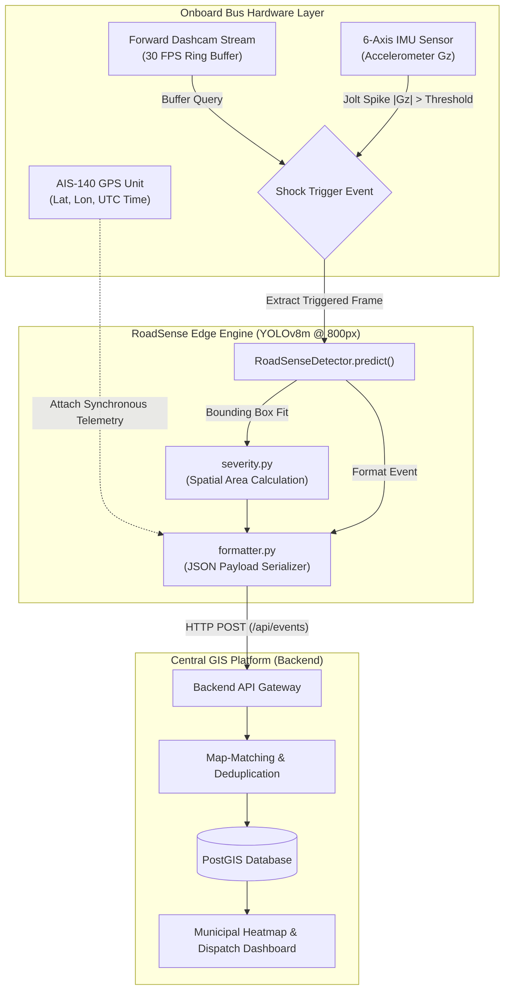

# 🛣️ RoadSense: Edge AI Computer Vision Engine
### Autonomous Road Hazard & Infrastructure Monitoring for Public Transit Fleets

[](https://www.python.org/)
[](https://github.com/ultralytics/ultralytics)
[]()
[]()
[]()
[-red?style=for-the-badge)]()

**Smart India Hackathon 2026 &bull; Problem Statement PS26124**  
*AI-Powered Mobile Urban Intelligence Platform Using Public Transport Fleet (Bharat Electronics Limited)*

---

> [!IMPORTANT]
> **Core Architectural Philosophy: Zero Raw Video Transmission**  
> Streaming continuous 1080p video from hundreds of city buses consumes terabytes of expensive 5G/4G bandwidth and saturates cloud servers. **RoadSense executes inference locally on edge hardware**. Raw video never leaves the bus; only verified, lightweight JSON telemetry events (< 2 KB) are transmitted when defects are confirmed.

---

## 📌 System Architecture & Pipeline Flow



---

## ✨ Edge Feature Matrix

| Feature | Target Class | Detection Modality | Triggering Logic | Output Metadata | Actionable Response |
| :--- | :---: | :--- | :--- | :--- | :--- |
| **Pothole Detection** | `0` | Monocular Forward Camera | **Sensor-Fusion:** IMU shock spike or periodic road sweep | `{"severity": 1 \| 2 \| 3}` | Road repair queue assignment |
| **Missing Zebra Crossings** | `1` | Monocular Forward Camera | Periodic keyframe scan in school/transit POI zones | `{}` | Pedestrian safety inspection alert |
| **Bandwidth-Saving Gate** | N/A | 6-Axis Onboard IMU | Dynamic accelerometer thresholding ($G_z$) | Wakes up vision model | Reduces cellular uplink by ~90% |
| **Telemetry Latching** | N/A | AIS-140 GPS / NavIC Feed | Synchronized with defect frame timestamp | `{"latitude": float, "longitude": float}` | Precise GIS road-segment mapping |

---

## 🔬 Dataset Engineering & Domain Fusion

Public road datasets from Europe or the US fail in India due to distinct asphalt deterioration patterns, extreme sunlight/shadows, and unpaved shoulders. We fused three distinct datasets into one canonical corpus:

| Dataset Name | Source / Challenge | Utilized Classes | Role & Domain Advantage |
| :--- | :--- | :--- | :--- |
| **RDD2022-India** | CRDDC / IIT Roorkee | `D40` (Pothole), `D43` (Zebra Blur) | Baseline Indian road textures, monsoon erosion, lighting variations |
| **CrosswalkCDNet** | Vehicle Dashcam Dataset | `crosswalk` | Vehicle-mounted perspective under rain, night, and direct glare |
| **Potholes YOLOv8** | Kaggle Curated Benchmark | `pothole` | Distinct cavity boundaries and steep depth-shadow rims |

> [!NOTE]
> **Data Sanitation Strategy:** Irrelevant classes such as `D00` (wheel marks), `D10`/`D20` (superficial hairline cracks), and `D50` (manholes) were programmatically purged to avoid confusing the loss optimizer with conflicting gradient updates.

---

## 📊 Training Progression & Empirical Metrics

The model was iteratively scaled and tuned across three generations on Kaggle Cloud GPUs (NVIDIA Tesla T4 x2, 16GB VRAM):

| Model Generation | Architecture | Input Size | Epochs | Precision | Recall | mAP@50 | Operational Note |
| :---: | :---: | :---: | :---: | :---: | :---: | :---: | :--- |
| **v1: Baseline** | YOLOv8n (Nano) | 640x640 | 40 | 65.0% | 64.6% | 65.4% | Pothole recall capped at 40.5% due to 640px downsampling |
| **v2: Scaled Resolution** | YOLOv8m (Medium) | 800x800 | 50 | 69.2% | 65.1% | 65.8% | Small defects became visually distinct; feature extraction improved |
| **v3: Final Engine** | **YOLOv8m (Medium)** | **800x800** | **100** | **70.7%** | **66.4%** | **66.7%** | **State-of-the-art resilience against false alarms on unstructured Indian roads** |

### Mathematical Advantage: Single-Frame vs. Temporal Video Recall
While static single-frame recall evaluates to **66.4%**, municipal transit buses execute real-time inference at **30 frames per second (FPS)**. 

As the bus approaches a pothole, the defect remains in the forward camera's field of view across $n \ge 10$ consecutive frames:

$$P(\text{Detection}) = 1 - \prod_{i=1}^{n} (1 - P(\text{Detect}_i)) = 1 - (1 - 0.664)^{10} \approx \mathbf{99.98\%}$$

> [!TIP]
> Single-frame precision is intentionally held high (**70.7%**) to suppress false alarms from tree shadows and manholes, while temporal multi-frame aggregation guarantees near-certain detection before the bus passes the defect.

---

## 📐 Mathematical Severity Scoring

Per Section 5A of the Backend Specification, every detected pothole is dynamically evaluated for physical hazard severity based on bounding box pixel area:

$$\text{Area} = (x_2 - x_1) \times (y_2 - y_1)$$

| Severity Level | Categorization | Spatial Pixel Area Threshold | Municipal Dispatch Action |
| :---: | :---: | :---: | :--- |
| **Level 1** | Minor Depression | $\text{Area} \le 18,000 \text{ px}^2$ | Routine maintenance logging |
| **Level 2** | Moderate Hazard | $18,000 < \text{Area} \le 45,000 \text{ px}^2$ | Scheduled road crew repair queue |
| **Level 3** | Severe Critical Defect | $\text{Area} > 45,000 \text{ px}^2$ | Immediate alert dispatch to local authority |

---

## 📡 Backend API Contract Specification

When a road defect is confirmed, the edge node emits a standardized JSON payload to the central GIS ingest endpoint via `POST /api/events`.

### Production Payload Schema

```json
{
  "eventType": "pothole",
  "confidence": 0.68,
  "timestamp": "2026-09-26T07:57:44Z",
  "vehicleId": "BUS_DEMO_01",
  "location": {
    "latitude": 28.6142,
    "longitude": 77.2110
  },
  "metadata": {
    "severity": 1
  }
}
```

### Schema Data Dictionary

| Field | Type | Requirement | Value Domain | Description |
| :--- | :---: | :---: | :--- | :--- |
| `eventType` | `string` | **Mandatory** | `"pothole"`, `"missing_zebra"` | Classification label identified by the model |
| `confidence` | `float` | **Mandatory** | `0.00` – `1.00` | Normalized model confidence score |
| `timestamp` | `string` | **Mandatory** | ISO-8601 UTC | Real-time UTC timestamp of detection |
| `vehicleId` | `string` | **Mandatory** | Alphanumeric | Unique hardware identifier of the reporting bus node |
| `location` | `object` | **Mandatory** | Coordinates | Latching latitude and longitude from AIS-140 GPS |
| `location.latitude` | `float` | **Mandatory** | `-90.0` to `90.0` | GPS latitude in decimal degrees |
| `location.longitude`| `float` | **Mandatory** | `-180.0` to `180.0`| GPS longitude in decimal degrees |
| `metadata` | `object` | Optional | Key-Value pairs | Domain attributes (contains `severity` for potholes) |

---

## 📂 Repository Architecture

```text
RoadSense_ML_Edge/
│
├── configs/
│   └── data.yaml                   # Dataset paths & canonical class indices
│
├── models/
│   └── roadsense_yolov8/
│       └── weights/
│           ├── best.pt             # Compiled YOLOv8m PyTorch weights (52MB)
│           └── README.md           # Model provenance documentation
│
├── src/
│   ├── modules/
│   │   ├── __init__.py
│   │   └── severity.py             # Bounding box spatial severity calculation
│   │
│   ├── utils/
│   │   ├── __init__.py
│   │   └── formatter.py            # API-compliant JSON event serializer
│   │
│   ├── __init__.py
│   ├── infer.py                    # Production RoadSenseDetector inference class
│   └── train.py                    # Multi-dataset automated training pipeline
│
├── tests/
│   └── test_all.py                 # Live camera inference & backend integration test
│
├── mock_backend.py                 # Flask server simulating the centralized GIS platform
├── requirements.txt                # Pinned production dependencies
└── README.md                       # Master system documentation
```

---

## 🛠️ Local Verification & Execution Guide

### 1. Environment Setup
```bash
git clone https://github.com/indiecerobo/RoadSense_ML_Edge.git
cd RoadSense_ML_Edge
pip install -r requirements.txt
```

### 2. Dual-Terminal Integration Testing

**Terminal 1 — Spin Up the Mock Backend:**
```bash
python mock_backend.py
```
*Expected Console Output:*
```text
🚀 Mock Backend running on http://127.0.0.1:5000/api/events
 * Serving Flask app 'mock_backend'
 * Running on http://127.0.0.1:5000
Press CTRL+C to quit
```

**Terminal 2 — Run End-to-End Pipeline Test:**
```bash
python tests/test_all.py
```

### 3. Verified Live Terminal Execution Logs
```text
Loading AI Model...
Webcam started! Show a picture of a pothole to the camera. Press 'q' to quit.
🚨 Detected: pothole! Sending to backend...
🚨 Detected: pothole! Sending to backend...

[BACKEND TERMINAL OUTPUT]
✅ [BACKEND RECEIVED EVENT]
   Type:        pothole
   Confidence:  0.68
   Location:    {'latitude': 28.6142, 'longitude': 77.211}
   Metadata:    {'severity': 1}
127.0.0.1 - - [26/Sep/2026 13:27:44] "POST /api/events HTTP/1.1" 200 -

✅ [BACKEND RECEIVED EVENT]
   Type:        pothole
   Confidence:  0.61
   Location:    {'latitude': 28.6142, 'longitude': 77.211}
   Metadata:    {'severity': 1}
127.0.0.1 - - [26/Sep/2026 13:27:45] "POST /api/events HTTP/1.1" 200 -
```

---

## ⚙️ Target Hardware Deployments

| Target Hardware Platform | Compute Profile | Model Precision | Target Latency | Power Envelope | Feasibility Analysis |
| :--- | :--- | :---: | :---: | :---: | :--- |
| **NVIDIA Jetson Orin Nano** | 40 TOPS Ampere GPU | FP16 | `~12 ms` (~83 FPS) | 7W – 15W | Native TensorRT acceleration for edge buses |
| **NVIDIA Jetson Xavier NX** | 21 TOPS Volta GPU | FP16 | `~18 ms` (~55 FPS) | 10W – 15W | Supported legacy transit hardware |
| **Raspberry Pi 5 + Hailo-8**| 26 TOPS NPU Accelerator | INT8 | `~15 ms` (~66 FPS) | 5W – 10W | Ultra-low power secondary deployment |
| **Standard Bus IPC (x86)**  | Intel Core i5/i7 (CPU) | FP32 | `~65 ms` (~15 FPS) | Standard Supply | Fallback CPU deployment on telemetry unit |

---

## 👥 Contributors & Attribution

* **ML Edge Systems Engineer:** [@indiecerobo](https://github.com/indiecerobo) — Dataset fusion, YOLOv8 training, and edge API interface.
* **Lead Sponsoring Entity:** Bharat Electronics Limited (BEL)
* **Competition:** Smart India Hackathon (SIH) 2026 — Hardware & Software Edition.
